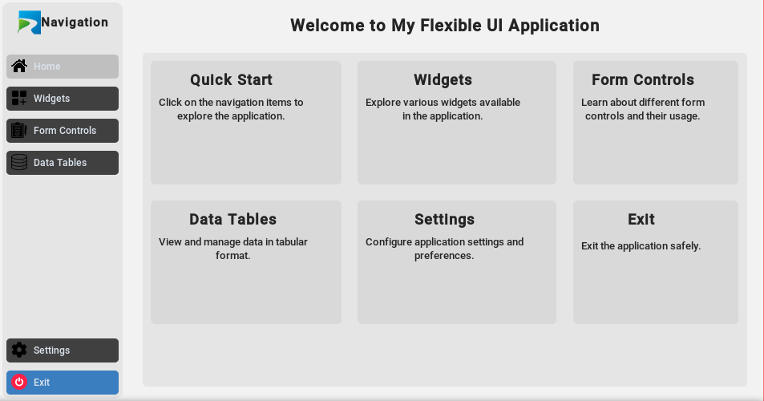
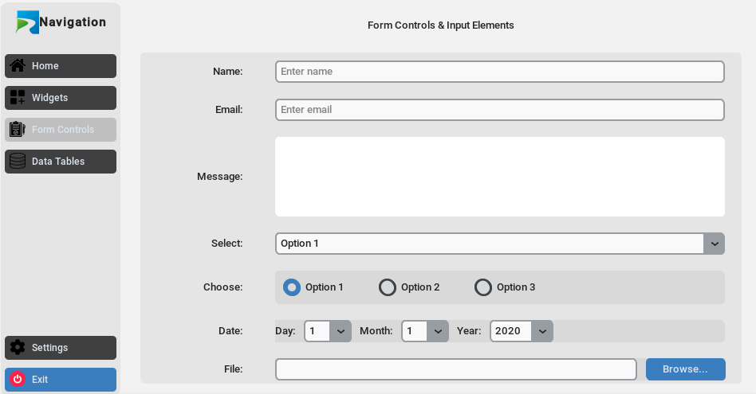
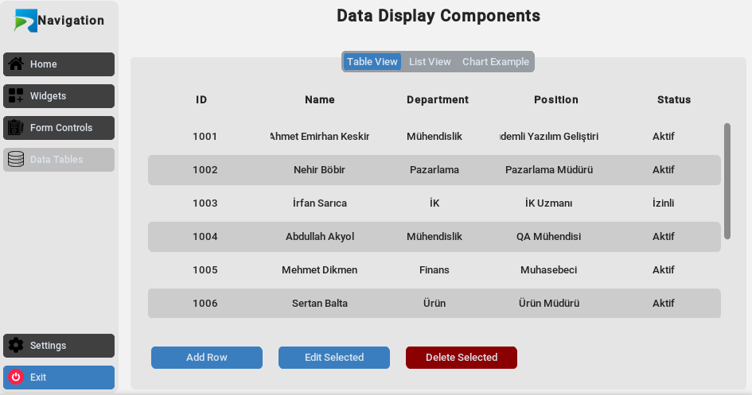
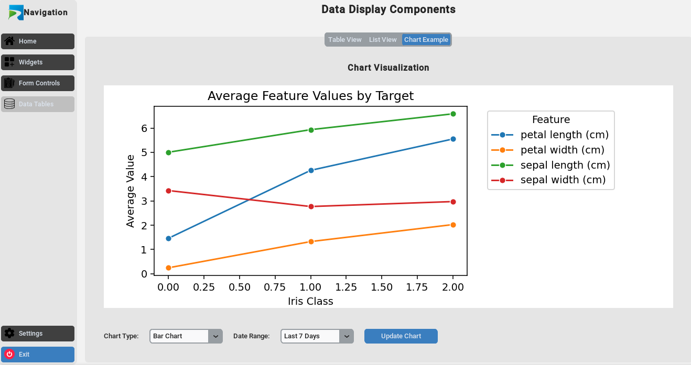

# PythonUI_App

**PythonUI_App** is a flexible and reusable desktop application template built with Python, designed to simplify the development of GUI-based projects. The template uses the **CustomTkinter** library to provide a modern, clean interface with customizable widgets and components. It allows developers to quickly set up a functional GUI with the ability to adjust it according to the needs of any project.

## Features

- **Custom Widgets**: Pre-configured widgets using **CustomTkinter** for a polished user interface.
- **Scalable and Customizable**: Easily extendable and modifiable to suit various project requirements.
- **Modern Design**: A sleek and contemporary look for desktop applications.
- **Reusable Template**: Save time on future GUI projects by reusing this template.

## Usage

To get started with **PythonUI_App**, simply clone the repository and customize it as per your project needs:

```bash
git clone https://github.com/emirhankskn/PythonUI_App.git
cd PythonUI_App
python main.py
```

## Requiremets
- **Python 3.x**
- **Customtkinter**
You can install CustomTkinter via pip:
```bash
pip install customtkinter
```

## Screenshots






